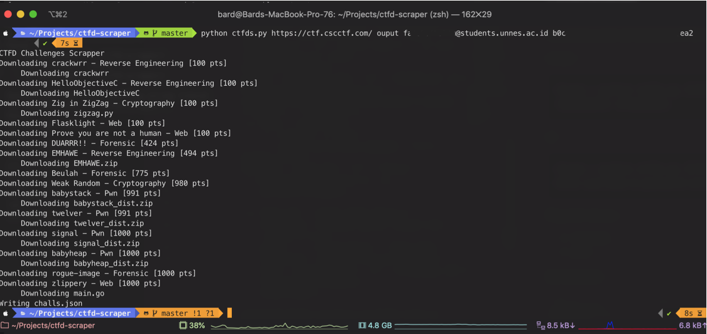

# CTFD Challenge Scrapper & Downloader

this simple script will download CTFD Challenges and its file (if any).

usage : 

    Usage : python ctfds.py [CTFD-URL] [output_dir] [USERNAME] [PASSWORD]

or

    Usage : python ctfds.py [CTFD-URL] [output_dir]
    #the username & password will be asked

Required Library : 

* requests
* json
 
### Screenshot


The __"output"__ dir : 
```bash
ouput
├── Cryptography
│   ├── Weak\ Random\ [980\ pts]
│   │   └── README.md
│   └── Zig\ in\ ZigZag\ [100\ pts]
│       ├── README.md
│       └── files
│           └── zigzag.py
├── Forensic
│   ├── Beulah\ [775\ pts]
│   │   └── README.md
│   ├── DUARRR!!\ [424\ pts]
│   │   └── README.md
│   └── rogue-image\ [1000\ pts]
│       └── README.md
├── Pwn
│   ├── babyheap\ [1000\ pts]
│   │   ├── README.md
│   │   └── files
│   │       └── babyheap_dist.zip
│   ├── babystack\ [991\ pts]
│   │   ├── README.md
│   │   └── files
│   │       └── babystack_dist.zip
│   ├── signal\ [1000\ pts]
│   │   ├── README.md
│   │   └── files
│   │       └── signal_dist.zip
│   └── twelver\ [991\ pts]
│       ├── README.md
│       └── files
│           └── twelver_dist.zip
├── Reverse\ Engineering
│   ├── EMHAWE\ [494\ pts]
│   │   ├── README.md
│   │   └── files
│   │       └── EMHAWE.zip
│   ├── HelloObjectiveC\ [100\ pts]
│   │   ├── README.md
│   │   └── files
│   │       └── HelloObjectiveC
│   └── crackwrr\ [100\ pts]
│       ├── README.md
│       └── files
│           └── crackwrr
├── Web
│   ├── Flasklight\ [100\ pts]
│   │   └── README.md
│   ├── Prove\ you\ are\ not\ a\ human\ [100\ pts]
│   │   └── README.md
│   └── zlippery\ [1000\ pts]
│       ├── README.md
│       └── files
│           └── main.go
└── challs.json

29 directories, 25 files
```
